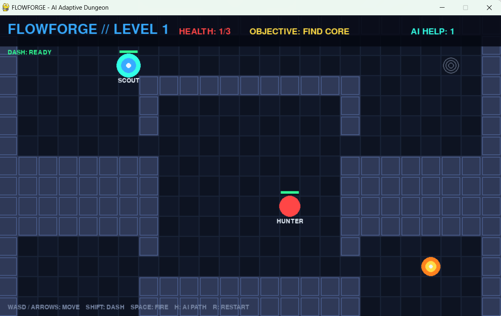
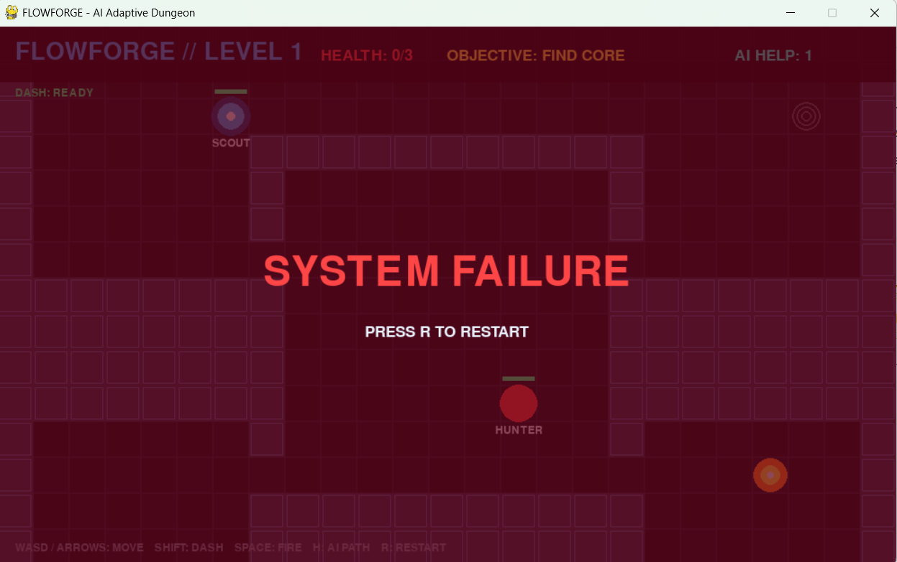
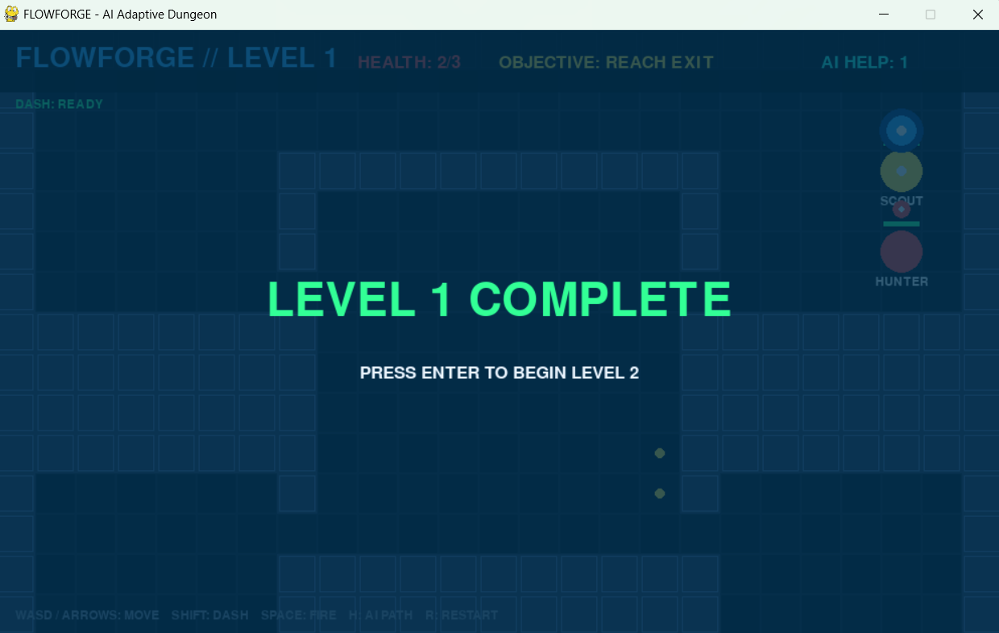
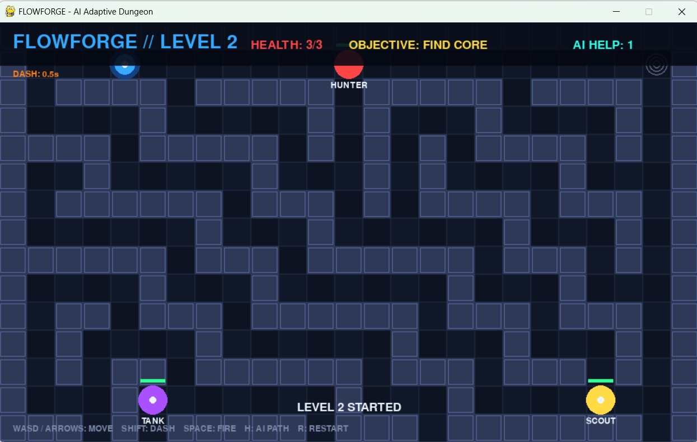

# 🎮 FlowForge – AI Adaptive Dungeon

> A 2D dungeon game built with Python and Pygame that integrates AI-based
> pathfinding for intelligent enemy navigation and player assistance.

---

## 📌 About the Project

**FlowForge – AI Adaptive Dungeon** is a 2D dungeon game developed using
**Python and Pygame**.

The project combines real-time game development with Artificial
Intelligence concepts, mainly **A* Pathfinding** and **Manhattan Distance**.

The AI system is used to calculate paths through the dungeon and support
enemy navigation. The same pathfinding concept is also used to provide
an AI-based path hint to the player.

The game includes multiple levels, different enemy types, shooting,
dash mechanics, health management, collision detection, core collection,
exit objectives and game-state transitions.

---

## 🎯 Problem Statement

Traditional 2D games often use predefined enemy movement and fixed
navigation behaviour.

When a game environment contains obstacles, directly moving an enemy
towards the player may not produce a suitable path.

FlowForge addresses this problem by integrating **A* pathfinding** into a
playable dungeon environment.

The project demonstrates how an AI pathfinding algorithm can be applied
to:

- Navigate enemies through the dungeon.
- Calculate paths around obstacles.
- Provide navigation assistance to the player.

---

## 🎯 Objectives

- Develop a functional 2D dungeon game using Python and Pygame.
- Implement player movement.
- Implement shooting mechanics.
- Implement a dash mechanism.
- Implement player health management.
- Create multiple enemy types.
- Implement enemy navigation.
- Implement A* pathfinding.
- Use Manhattan Distance as the A* heuristic.
- Implement collision detection.
- Provide AI-based path assistance.
- Implement core and exit objectives.
- Implement multiple dungeon levels.
- Implement level progression.
- Add sound effects and visual feedback.
- Demonstrate practical application of AI concepts in game development.

---

# ✨ Features

## 👤 Player

- WASD / Arrow key movement
- Shooting
- Dash ability
- Health system
- Collision detection
- Core interaction
- Exit interaction
- Level progression
- Restart after failure

## 👾 Enemy System

FlowForge contains three enemy types:

| Enemy | Behaviour |
|---|---|
| 🔴 **Hunter** | Pursues the player using navigation behaviour |
| 🔵 **Scout** | Faster and lighter enemy behaviour |
| 🟣 **Tank** | Stronger enemy with greater resistance |

## 🤖 AI Features

- A* Pathfinding
- Manhattan Distance heuristic
- Grid-based navigation
- Enemy path calculation
- AI path assistance
- Navigation around obstacles

## 🎮 Game Features

- Multiple dungeon levels
- Enemy attacks
- Enemy projectiles
- Collision detection
- Health management
- Dash mechanics
- Sound effects
- Visual effects
- Core collection
- Exit objectives
- Level completion
- System failure state
- Restart functionality

---

# 🧠 AI Implementation

## 1. A* Pathfinding

A* is a pathfinding algorithm used to find an efficient path between a
starting position and a target position.

The evaluation function is:

```text
f(n) = g(n) + h(n)
```

Where:

```text
g(n) = Actual cost from the starting node
h(n) = Estimated cost to the destination
f(n) = Total estimated cost
```

FlowForge uses A* for path calculation in the dungeon environment.

### A* Flow

```text
Start Position
      │
      ▼
Target Position
      │
      ▼
Find Valid Neighbours
      │
      ▼
Calculate g(n)
      │
      ▼
Calculate h(n)
      │
      ▼
Calculate f(n)
      │
      ▼
Select Lowest-Cost Node
      │
      ▼
Continue Search
      │
      ▼
Target Reached
      │
      ▼
Reconstruct Path
```

---

## 2. Manhattan Distance

Manhattan Distance is used as the heuristic function for A*.

The formula is:

```text
h(n) = |x1 - x2| + |y1 - y2|
```

For example:

```text
Current Position = (2, 3)
Target Position  = (7, 5)

h(n) = |2 - 7| + |3 - 5|
     = 5 + 2
     = 7
```

Therefore, the Manhattan Distance is `7`.

---

## 3. Enemy Navigation

The enemy navigation process is:

```text
Enemy Position
      │
      ▼
Player / Target Position
      │
      ▼
Pathfinding System
      │
      ▼
Manhattan Distance
      │
      ▼
A* Algorithm
      │
      ▼
Calculated Path
      │
      ▼
Enemy Movement
```

This allows the enemy to navigate through the dungeon environment rather
than simply moving directly toward the player.

---

## 4. AI Path Assistance

The player can request an AI path hint using the `H` key.

```text
Player Requests Hint
        │
        ▼
Pathfinding System
        │
        ▼
A* Algorithm
        │
        ▼
Manhattan Heuristic
        │
        ▼
Calculate Path
        │
        ▼
Display AI Assistance
```

---

# 🏗️ System Architecture

```text
                         ┌─────────────────────┐
                         │    PLAYER INPUT     │
                         │  Keyboard / Events  │
                         └──────────┬──────────┘
                                    │
                                    ▼
                         ┌─────────────────────┐
                         │      GAME LOOP      │
                         │                     │
                         │ Event Handling      │
                         │ State Updating      │
                         │ Rendering           │
                         └──────────┬──────────┘
                                    │
             ┌──────────────────────┼──────────────────────┐
             │                      │                      │
             ▼                      ▼                      ▼
      ┌──────────────┐       ┌──────────────┐       ┌──────────────┐
      │    PLAYER    │       │    ENEMY     │       │    LEVEL     │
      │    MODULE    │       │    MODULE    │       │    MODULE    │
      ├──────────────┤       ├──────────────┤       ├──────────────┤
      │ Movement     │       │ Hunter       │       │ Dungeon      │
      │ Shooting     │       │ Scout        │       │ Walls        │
      │ Dash         │       │ Tank         │       │ Core         │
      │ Health       │       │ Attacks      │       │ Exit         │
      └──────┬───────┘       └──────┬───────┘       └──────────────┘
             │                      │
             │                      ▼
             │             ┌─────────────────┐
             │             │   PATHFINDING   │
             │             │                 │
             │             │       A*        │
             │             │   Manhattan     │
             │             │    Distance     │
             │             └────────┬────────┘
             │                      │
             └──────────┬───────────┘
                        │
                        ▼
             ┌──────────────────────┐
             │ COLLISION & OBJECTIVE│
             │      MANAGEMENT      │
             └──────────┬───────────┘
                        │
                        ▼
             ┌──────────────────────┐
             │  LEVEL PROGRESSION   │
             └──────────────────────┘
```

---

# 🔄 System Flow

```text
                         START
                           │
                           ▼
                  Initialize Pygame
                           │
                           ▼
                  Load Game Settings
                           │
                           ▼
                      Load Level
                           │
                           ▼
               Create Player & Enemies
                           │
                           ▼
                     Read Input
                           │
                           ▼
                Update Player Movement
                           │
                           ▼
                  Shooting / Dash
                           │
                           ▼
                  Update Enemy AI
                           │
                           ▼
             Calculate A* Path if Needed
                           │
                           ▼
               Check Collision & Health
                           │
                           ▼
                    Check Objective
                           │
                           ▼
                     Check Exit
                           │
                           ▼
                  Level Complete?
                     /       \
                   No         Yes
                   │           │
                   │           ▼
                   │      Next Level
                   │           │
                   └─────┬─────┘
                         │
                         ▼
                  Continue Game Loop
                         │
                         ▼
                        END
```

---

# 🎮 Gameplay Flow

```text
                    START GAME
                        │
                        ▼
                   ENTER DUNGEON
                        │
                        ▼
                EXPLORE ENVIRONMENT
                        │
                        ▼
                  ENCOUNTER ENEMY
                        │
                        ▼
                 FIGHT / AVOID
                        │
                        ▼
                  FIND CORE
                        │
                        ▼
                COMPLETE OBJECTIVE
                        │
                        ▼
                   REACH EXIT
                        │
                        ▼
                 LEVEL COMPLETE
                        │
                        ▼
                   NEXT LEVEL
```

---

# 💥 Combat Flow

```text
Player
  │
  ▼
Press SPACE
  │
  ▼
Create Projectile
  │
  ▼
Projectile Movement
  │
  ▼
Enemy Collision?
   /       \
 No         Yes
 │           │
 │           ▼
 │      Apply Damage
 │           │
 │           ▼
 │      Update Enemy
 │
 ▼
Continue Game
```

---

# ❤️ Health & Failure Flow

```text
Player Health
      │
      ▼
Enemy / Projectile Collision
      │
      ▼
Damage Applied
      │
      ▼
Health Reduced
      │
      ▼
Health > 0 ?
    /      \
  Yes       No
   │         │
   ▼         ▼
Continue   SYSTEM FAILURE
             │
             ▼
         Press R
             │
             ▼
          Restart
```

---

# 🚀 Level Progression

FlowForge contains multiple dungeon levels.

A completed level displays a transition screen before the next level
starts.

```text
             LEVEL 1
                │
                ▼
        Complete Objective
                │
                ▼
         LEVEL 1 COMPLETE
                │
                ▼
          Press ENTER
                │
                ▼
             LEVEL 2
                │
                ▼
          Continue Game
```

---

# 🎮 Game Controls

| Key | Action |
|---|---|
| `W` / `↑` | Move Up |
| `S` / `↓` | Move Down |
| `A` / `←` | Move Left |
| `D` / `→` | Move Right |
| `SPACE` | Fire |
| `SHIFT` | Dash |
| `H` | AI Path Hint |
| `R` | Restart after failure |
| `ENTER` | Begin next level |

---

# 🖼️ Screenshots

The following screenshots show actual gameplay states of FlowForge.

## Level 1 – Active Gameplay



Level 1 gameplay showing the dungeon environment, player, Hunter,
Scout, health status, objective and AI help indicator.

---

## Level 1 – Complete



Level completion screen displayed after successfully completing Level 1.
The player can press `ENTER` to begin Level 2.

---

## System Failure



System failure state displayed when the player's health reaches zero.
The player can press `R` to restart.

---

## Level 2 – Gameplay



Level 2 gameplay showing the updated dungeon layout, Hunter, Scout and
Tank enemies, player health and the current objective.

---

# 🛠️ Technology Stack

| Technology | Purpose |
|---|---|
| **Python** | Main programming language |
| **Pygame** | 2D game development |
| **A\*** | AI pathfinding |
| **Manhattan Distance** | A* heuristic |
| **Git** | Version control |
| **GitHub** | Source code hosting |
| **VS Code** | Development environment |

---

# 📂 Project Structure

```text
FlowForge/
│
├── main.py
├── settings.py
├── level.py
├── pathfinding.py
├── enemy.py
├── player.py
│
├── sounds/
│   ├── shoot.wav
│   ├── explosion.wav
│   ├── damage.wav
│   ├── core.wav
│   └── win.wav
│
├── screenshots/
│   ├── gameplay1.png
│   ├── gameplay2.png
│   ├── gameplay3.png
│   └── gameplay4.png
│
├── .gitignore
└── README.md
```

---

# 📄 Module Description

## `main.py`

Main entry point of the game.

Handles:

- Pygame initialization
- Game loop
- Keyboard events
- Game state
- Object updates
- Rendering
- Level switching

---

## `settings.py`

Contains common game configuration and constants.

Handles:

- Screen dimensions
- Colours
- Configuration values
- Common constants
- Game settings

---

## `level.py`

Manages the dungeon environment.

Handles:

- Dungeon layout
- Walls
- Obstacles
- Core
- Exit
- Level information

---

## `pathfinding.py`

Contains the AI pathfinding logic.

Handles:

- Manhattan Distance
- A* Pathfinding
- Grid navigation
- Path calculation
- AI assistance

---

## `player.py`

Controls the player.

Handles:

- Movement
- Shooting
- Dash
- Health
- Player state
- Player interactions

---

## `enemy.py`

Contains enemy classes and behaviours.

Handles:

- Hunter
- Scout
- Tank
- Enemy movement
- Enemy detection
- Enemy attacks
- Enemy health
- Enemy interactions

---

## `sounds/`

Contains the sound effects used during gameplay.

```text
sounds/
├── shoot.wav
├── explosion.wav
├── damage.wav
├── core.wav
└── win.wav
```

---

# 🔁 High-Level Data Flow

```text
                    PLAYER INPUT
                         │
                         ▼
                     GAME LOOP
                         │
             ┌───────────┴───────────┐
             │                       │
             ▼                       ▼
          PLAYER                   ENEMY
          UPDATE                   UPDATE
             │                       │
             │                       ▼
             │                  PATHFINDING
             │                       │
             │               ┌───────┴───────┐
             │               │               │
             │               ▼               ▼
             │              A*          Manhattan
             │                          Distance
             │
             └───────────┬───────────────┘
                         │
                         ▼
                  COLLISION CHECK
                         │
                         ▼
                    GAME STATE
                         │
             ┌───────────┼───────────┐
             │           │           │
             ▼           ▼           ▼
          Health      Objective    Level
                                      │
                                      ▼
                              Level Progression
```

---

# 🧪 Testing

The following major components were tested during development:

| Component | Status |
|---|---|
| Pygame Initialization | ✅ |
| Player Movement | ✅ |
| Wall / Boundary Collision | ✅ |
| Shooting | ✅ |
| Dash | ✅ |
| Hunter Behaviour | ✅ |
| Scout Behaviour | ✅ |
| Tank Behaviour | ✅ |
| Enemy Attacks | ✅ |
| A* Pathfinding | ✅ |
| Manhattan Distance | ✅ |
| Collision Detection | ✅ |
| Health System | ✅ |
| Core Objective | ✅ |
| Exit Condition | ✅ |
| Level Switching | ✅ |
| Sound Effects | ✅ |
| AI Path Hint | ✅ |
| System Failure | ✅ |
| Restart | ✅ |

---

# ⚠️ Current Limitations

The current version of FlowForge is focused on demonstrating
AI pathfinding concepts in a 2D game.

Current limitations include:

- Enemy behaviours are predefined.
- Dungeon layouts are predefined.
- The AI system primarily uses algorithmic pathfinding.
- A* is used for navigation rather than a trained machine-learning model.
- The number of levels is limited.
- Advanced player behaviour modelling is not implemented.
- Dynamic machine-learning-based difficulty adjustment is not currently
  implemented.
- The game is primarily designed for desktop keyboard input.

---

# 🚀 Future Scope

Possible future improvements include:

### Procedural Dungeon Generation

Generate dungeon layouts dynamically instead of using predefined maps.

### Advanced Adaptive Difficulty

Analyse player performance and dynamically modify:

- Enemy speed
- Enemy count
- Enemy strength
- Player assistance
- Level difficulty

### Machine Learning

A machine-learning model could be added to analyse player behaviour and
adapt the game experience.

### Advanced Enemy AI

Future enemy behaviour could include:

- Behaviour trees
- State machines
- Predictive movement
- Group coordination
- Advanced decision-making

### More Levels

Additional levels could introduce:

- New dungeon layouts
- New obstacles
- New enemy types
- New objectives
- Increasing difficulty

### Additional Player Abilities

Future versions could include:

- Multiple weapons
- Special attacks
- Shields
- Health recovery
- Additional movement abilities

### Player Analytics

The game could collect gameplay information such as:

- Completion time
- Damage received
- Number of deaths
- Movement patterns
- Level progress
- Enemy interactions

### Standalone Executable

The game can be packaged as a standalone executable for easier
distribution.

---

# 💻 Installation

## Requirements

Make sure the following are installed:

- Python 3.x
- Git
- Pygame

---

## 1. Clone the Repository

```bash
git clone https://github.com/YOUR_USERNAME/FlowForge.git
```

Replace `YOUR_USERNAME` with your GitHub username.

---

## 2. Open the Project

```bash
cd FlowForge
```

---

## 3. Create Virtual Environment

### Windows

```powershell
python -m venv venv
```

---

## 4. Activate Virtual Environment

### PowerShell

```powershell
venv\Scripts\activate
```

If PowerShell blocks activation, use Command Prompt:

```cmd
venv\Scripts\activate
```

---

## 5. Install Pygame

```powershell
pip install pygame
```

---

# ▶️ Run the Project

After installing the dependency:

```powershell
python main.py
```

The Pygame window will open and the game can be played using the controls
listed above.

---

# 🔧 Development

The project uses a modular structure so that gameplay, AI, level
management and configuration are separated into different files.

```text
main.py
   │
   ├── player.py
   │
   ├── enemy.py
   │
   ├── level.py
   │
   ├── pathfinding.py
   │
   └── settings.py
```

This makes individual components easier to modify, test and maintain.

---

# 📦 Dependencies

The primary external dependency is:

```text
pygame
```

Install it using:

```bash
pip install pygame
```

---

# 🧩 Core Concepts Demonstrated

FlowForge demonstrates the following concepts:

### Programming

- Python
- Object-oriented programming
- Functions and classes
- Modular programming
- Event-driven programming

### Game Development

- Pygame
- Game loop
- Keyboard input
- Real-time rendering
- Collision detection
- Game states
- Projectiles
- Health systems
- Level management
- Sound effects

### Artificial Intelligence

- A* Pathfinding
- Manhattan Distance
- Grid-based navigation
- Enemy navigation
- AI-assisted navigation

### Software Development

- Project structuring
- Debugging
- Testing
- Virtual environments
- Git
- GitHub
- Documentation

---

# 🏁 Conclusion

**FlowForge – AI Adaptive Dungeon** demonstrates how Artificial
Intelligence concepts can be integrated into a real-time 2D game.

The project combines Python and Pygame with **A* Pathfinding** and
**Manhattan Distance** to implement intelligent navigation.

Along with the AI component, the project includes:

- Player movement
- Shooting
- Dash mechanics
- Enemy behaviours
- Hunter, Scout and Tank enemies
- Collision detection
- Health management
- Core objectives
- Exit objectives
- Level progression
- AI path assistance
- Sound effects
- Failure and restart states

The modular architecture separates gameplay, player, enemy, level and
pathfinding components, making the project easier to understand and
extend.

Future versions can extend the project with procedural dungeon
generation, advanced enemy AI, adaptive difficulty, machine learning and
additional gameplay features.

---

# ⭐ Project Highlights

```text
┌──────────────────────────────────────────────┐
│                  FLOWFORGE                   │
│             AI Adaptive Dungeon              │
├──────────────────────────────────────────────┤
│                                              │
│  🎮 2D Pygame Game                          │
│  🤖 A* Pathfinding                           │
│  📐 Manhattan Distance                       │
│  👾 Hunter • Scout • Tank                    │
│  🔫 Shooting System                          │
│  ⚡ Dash Mechanism                            │
│  ❤️ Health System                             │
│  🧭 AI Path Assistance                       │
│  🗺️ Multiple Dungeon Levels                  │
│  🔊 Sound Effects                            │
│  🏆 Core & Exit Objectives                   │
│                                              │
└──────────────────────────────────────────────┘
```

---

## 👩‍💻 Developed By

**Akanksha Mangesh Deshmukh**

Computer Engineering  
Trinity Academy of Engineering

---

⭐ **FlowForge – AI Adaptive Dungeon**

*An educational implementation of AI pathfinding concepts in a
real-time 2D game environment.*
